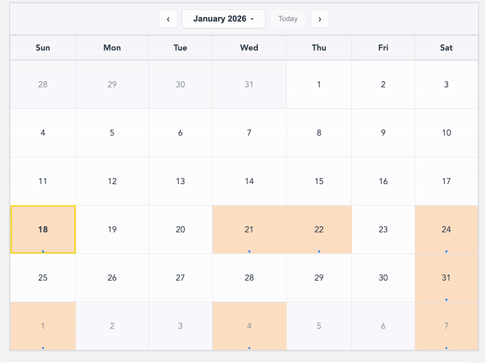
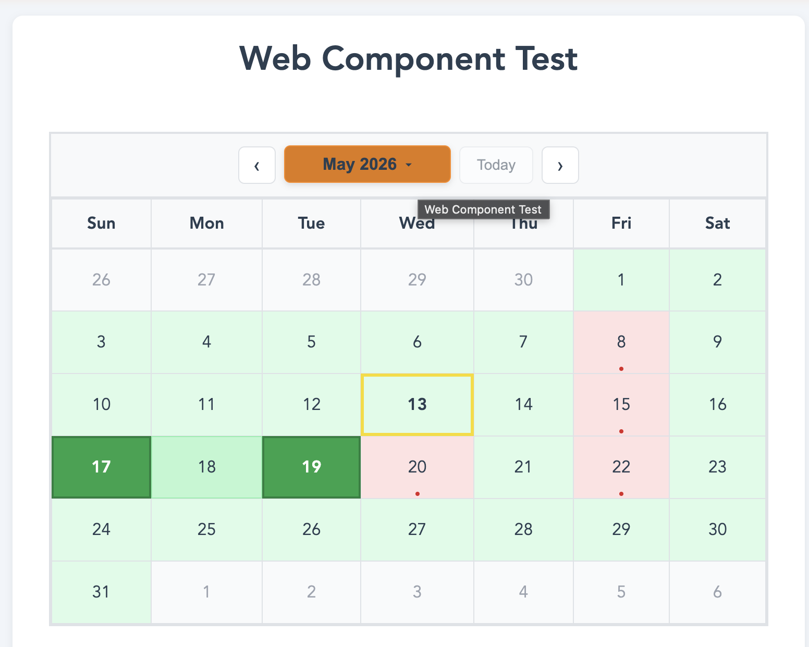
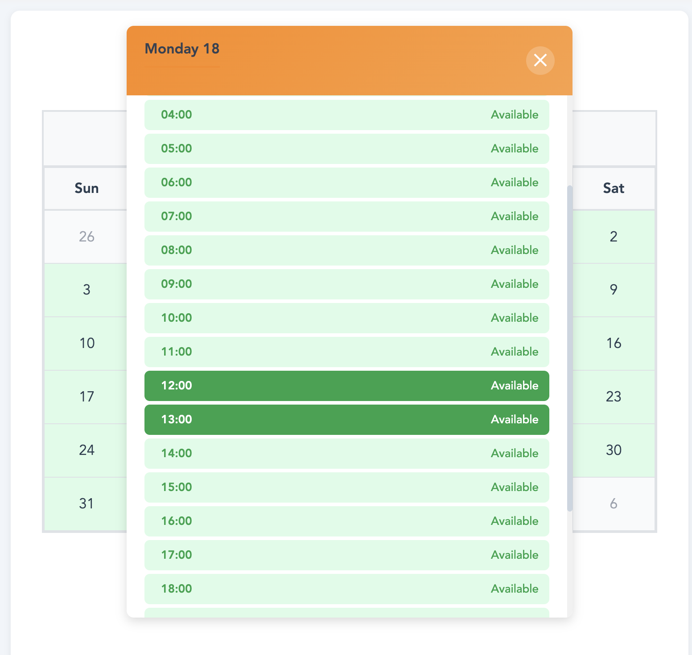

# kalendly

A universal calendar web component — works in React, Vue, Svelte, Angular, Solid.js, and plain HTML with no framework dependency.

## Features

- **Framework-agnostic**: Single `<kal-calendar>` custom element, no framework required
- **Responsive**: Mobile-friendly, matches your existing UI
- **Themeable**: CSS variables + JS property API
- **Type Safe**: Full TypeScript support
- **Event-rich**: Categories, priorities, time ranges, attendees, and more
- **Availability mode**: Day and time views for booking flows — hides event details, shows booked/free cells
- **Lazy loading**: Per-month on-demand fetch with skeleton shimmer state
- **Accessible**: Built with accessibility in mind
- **Tree-shakeable**: Import only what you need

## Live Demo

<div align="center">

[](https://kalendly-example.netlify.app/)

**[Try the Interactive Demo →](https://kalendly-example.netlify.app/)**

</div>

<p align="center">
  <a href="https://kalendly-example.netlify.app/vanilla">
    
  </a>
  <a href="https://kalendly-example.netlify.app/react">
    
  </a>
  <a href="https://kalendly-example.netlify.app/vue">
    
  </a>
  <a href="https://kalendly-example.netlify.app/angular">
    
  </a>
  <a href="https://kalendly-example.netlify.app/svelte">
    
  </a>
  <a href="https://kalendly-example.netlify.app/solid">
    
  </a>
</p>

## Installation

```bash
npm install kalendly
```

## Usage

### Vanilla HTML / CDN

```html
<link
  rel="stylesheet"
  href="https://unpkg.com/kalendly/dist/styles/calendar.css"
/>
<script src="https://unpkg.com/kalendly/dist/index.umd.js"></script>

<kal-calendar id="cal" heading="My Calendar"></kal-calendar>

<script>
  const cal = document.getElementById('cal');

  // Set events (JS property — not an attribute)
  cal.events = [
    { id: 1, name: 'Team Meeting', date: new Date(2025, 0, 15) },
    { id: 2, name: 'Project Deadline', date: new Date(2025, 0, 20) },
  ];

  // Listen to custom events
  cal.addEventListener('cal-date-select', e => {
    console.log('Selected:', e.detail.date, e.detail.events);
  });

  cal.addEventListener('cal-month-change', e => {
    console.log('Month:', e.detail.year, e.detail.month);
  });
</script>
```

### ES Modules

```js
import 'kalendly';
import 'kalendly/styles';

// <kal-calendar> is now registered and ready
```

### React 19

React 19 has full custom element support — pass objects/arrays as props and listen to custom events directly.

```jsx
import 'kalendly';
import 'kalendly/styles';

function App() {
  return (
    <kal-calendar
      heading="My Calendar"
      events={events}
      oncal-date-select={e => console.log(e.detail.date)}
      oncal-month-change={e => console.log(e.detail.year, e.detail.month)}
    />
  );
}
```

> **React 18 users:** React 18 does not forward object/array props or custom events to custom elements. You need to wire these up via a `ref`:
>
> ```jsx
> import { useRef, useEffect } from 'react';
> import 'kalendly';
>
> function Calendar({ events, onDateSelect, onMonthChange, ...attrs }) {
>   const ref = useRef(null);
>
>   useEffect(() => {
>     if (ref.current) ref.current.events = events;
>   }, [events]);
>
>   useEffect(() => {
>     const el = ref.current;
>     if (!el) return;
>     const onSelect = e => onDateSelect?.(e.detail.date, e.detail.events);
>     const onChange = e => onMonthChange?.(e.detail.year, e.detail.month);
>     el.addEventListener('cal-date-select', onSelect);
>     el.addEventListener('cal-month-change', onChange);
>     return () => {
>       el.removeEventListener('cal-date-select', onSelect);
>       el.removeEventListener('cal-month-change', onChange);
>     };
>   }, [onDateSelect, onMonthChange]);
>
>   return <kal-calendar ref={ref} {...attrs} />;
> }
> ```

### Vue 3

Vue 3 supports custom elements natively — bind props with `:` and listen to events with `@`.

> **Vue-specific:** Vue's template compiler warns on unknown tags. React, Solid.js, and Svelte treat hyphenated tags as DOM elements natively — no config needed. Angular uses `CUSTOM_ELEMENTS_SCHEMA` (see the Angular section below).

Tell Vue's compiler that `<kal-*>` tags are native custom elements. The config location depends on your build tool:

**Vite** (`vite.config.ts`):

```ts
vue({
  template: {
    compilerOptions: {
      isCustomElement: tag => tag.startsWith('kal-'),
    },
  },
});
```

**Nuxt 3** (`nuxt.config.ts`):

```ts
export default defineNuxtConfig({
  vue: {
    compilerOptions: {
      isCustomElement: tag => tag.startsWith('kal-'),
    },
  },
});
```

**webpack / Vue CLI** (`vue.config.js`):

```js
module.exports = {
  chainWebpack: config => {
    config.module
      .rule('vue')
      .use('vue-loader')
      .tap(options => ({
        ...options,
        compilerOptions: {
          isCustomElement: tag => tag.startsWith('kal-'),
        },
      }));
  },
};
```

Without this the component still renders correctly — Vue falls back to a native DOM element. This only suppresses the console warning.

```vue
<template>
  <kal-calendar
    heading="My Calendar"
    :events="events"
    @cal-date-select="onDateSelect"
    @cal-month-change="onMonthChange"
  />
</template>

<script setup>
import 'kalendly';
import 'kalendly/styles';

const events = [{ id: 1, name: 'Team Meeting', date: new Date(2025, 0, 15) }];

function onDateSelect(e) {
  console.log('Selected:', e.detail.date);
}

function onMonthChange(e) {
  console.log('Month:', e.detail.year, e.detail.month);
}
</script>
```

### Angular

```ts
// app.config.ts
import { ApplicationConfig } from '@angular/core';
import { CUSTOM_ELEMENTS_SCHEMA } from '@angular/core';

// app.component.ts
import 'kalendly';
import 'kalendly/styles';
```

```html
<!-- app.component.html -->
<kal-calendar
  heading="My Calendar"
  [events]="events"
  (cal-date-select)="onDateSelect($event)"
  (cal-month-change)="onMonthChange($event)"
></kal-calendar>
```

### Svelte 5

```svelte
<script>
  import 'kalendly';
  import 'kalendly/styles';
  let { events = [] } = $props();
</script>

<kal-calendar {events} oncal-date-select={e => console.log(e.detail.date)} />
```

### Svelte 4

```svelte
<script>
  import { onMount } from 'svelte';
  import 'kalendly';
  import 'kalendly/styles';
  export let events = [];
  let calEl;
  onMount(() => { calEl.events = events; });
  $: if (calEl) calEl.events = events;
</script>

<kal-calendar bind:this={calEl} on:cal-date-select on:cal-month-change />
```

### Solid.js

```jsx
import 'kalendly';
import 'kalendly/styles';

function App() {
  return (
    <kal-calendar
      heading="My Calendar"
      prop:events={events}
      on:cal-date-select={e => console.log(e.detail.date)}
    />
  );
}
```

## Styling

### Loading styles

```js
// Bundler (Vite, webpack) — add once in your app entry (e.g. main.tsx)
import 'kalendly/styles';

// Plain HTML
// <link rel="stylesheet" href="/node_modules/kalendly/dist/styles/calendar.css">

// Angular — add to angular.json → projects → architect → build → styles
// "node_modules/kalendly/dist/styles/calendar.css"
```

### Overriding styles

kalendly uses Light DOM — all standard CSS techniques work:

```css
/* 1. CSS custom properties (recommended) */
:root {
  --calendar-primary-color: #6366f1;
  --calendar-background: #1e1e2e;
  --calendar-border-color: #334155;
}

/* 2. Direct class overrides */
.kalendly-calendar .calendar-card {
  border-radius: 12px;
}
```

```js
// 3. JS theme property
document.querySelector('kal-calendar').theme = {
  primary: '#6366f1',
  background: '#1e1e2e',
};
```

## Attributes

Primitives are set as HTML attributes:

| Attribute               | Type              | Default          | Description                                        |
| ----------------------- | ----------------- | ---------------- | -------------------------------------------------- |
| `heading`               | `string`          | —                | Calendar heading                                   |
| `title`                 | `string`          | —                | **Deprecated** — use `heading`                     |
| `initial-date`          | `string`          | today            | ISO date string for initial view                   |
| `months`                | `"1"\|"2"`        | `"1"`            | Render two months side by side                     |
| `min-year`              | `string`          | currentYear - 30 | Minimum year in picker                             |
| `max-year`              | `string`          | currentYear + 10 | Maximum year in picker                             |
| `min-date`              | `string`          | —                | Earliest bookable day, inclusive                   |
| `max-date`              | `string`          | —                | Latest bookable day, inclusive                     |
| `available-days`        | `string`          | —                | Bookable weekdays, e.g. `"1,2,3,4,5"`              |
| `available-hours`       | `string`          | —                | Bookable hours, e.g. `"09:00-17:00"`               |
| `week-starts-on`        | `"0"\|"1"`        | `"0"`            | Week start: 0 = Sunday, 1 = Monday                 |
| `use-short-month-names` | `string`          | —                | Present = use abbreviated month names              |
| `availability-mode`     | `"day"\|"time"`   | —                | Hides event details; shows booked/free cells       |
| `slot-duration`         | `string` (number) | `"60"`           | Time-grid granularity in minutes; must divide 1440 |
| `selectable`            | `"range"`         | —                | Enables day/slot selection (requires avail mode)   |
| `loading`               | `boolean` (flag)  | —                | Present = render skeleton shimmer cells            |

## Properties

Rich objects are set as JS properties (not attributes):

| Property             | Type                               | Description                                       |
| -------------------- | ---------------------------------- | ------------------------------------------------- |
| `events`             | `CalendarEvent[]`                  | Events to display                                 |
| `loading`            | `boolean`                          | `true` = render skeleton cells; `false` = restore |
| `theme`              | `CalendarTheme`                    | Custom theme colors                               |
| `categoryColors`     | `CategoryColorMap`                 | Per-category color overrides                      |
| `renderEvent`        | `(event: CalendarEvent) => string` | Custom event HTML renderer                        |
| `renderNoEvents`     | `() => string`                     | Custom empty-state HTML renderer                  |
| `availabilityColors` | `Record<string, string>`           | Colour per availability bucket                    |
| `selectableStatuses` | `string[]`                         | Buckets a range may start, end or span            |

> `renderEvent` and `renderNoEvents` are ignored when `availability-mode` is set.

### Why `heading` and not `title`

`title` is a global HTML attribute, so the browser renders it as a tooltip floating over the whole calendar as well as using it as the heading. `heading` does the same job without the tooltip. `title` still works and warns once per page; it will be removed in a future release.

## Custom Events

| Event                     | `detail` shape                                                         | Description                                               |
| ------------------------- | ---------------------------------------------------------------------- | --------------------------------------------------------- |
| `cal-date-select`         | `{ date: Date, events: CalendarEvent[] }`                              | User clicked a date (normal mode)                         |
| `cal-month-change`        | `{ year: number, month: number }`                                      | Fires **before** the new month renders                    |
| `cal-availability-select` | `{ startDate: Date, endDate: Date }` or `{ date, startTime, endTime }` | Day/slot selected in availability mode                    |
| `cal-slot-select`         | `{ date: Date, startTime: string, endTime: string, booked: boolean }`  | Any time slot clicked, whether or not `selectable` is set |

All events bubble and are composed (cross Shadow DOM boundaries).

`cal-availability-select` detail shape depends on mode:

- **Day mode** (`availability-mode="day"`): `{ startDate: Date, endDate: Date }` — first click gives `startDate === endDate`; second click extends the range; third click resets
- **Time mode** (`availability-mode="time"`): `{ date: Date, startTime: string, endTime: string }` — first click selects a single slot; second click extends; third click resets

## Availability Mode

Hides all event details from the end user — only booked/free state is shown. Designed for scheduling and booking flows where the server's event data must not be exposed to the viewer.

### Day view

```html
<kal-calendar availability-mode="day"></kal-calendar>
```

Every event must declare `availabilityStatus`. Three buckets ship built in, coloured as a traffic light:

| Bucket        | Colour | Meaning                                   |
| ------------- | ------ | ----------------------------------------- |
| `open`        | green  | nothing claims this day                   |
| `conditional` | amber  | claimed, but not necessarily hard-blocked |
| `blocked`     | red    | not available                             |

```js
cal.events = [
  { id: 1, date: '2026-03-02', availabilityStatus: 'blocked' },
  { id: 2, date: '2026-03-05', availabilityStatus: 'conditional' },
];
```

Only cells in the current month are colour-coded — other-month cells remain grayed out. Clicking a day fires no popup and reveals no event details.

A day holding several events resolves by severity: `blocked` beats `conditional` beats `open`, so a day with both a conditional and a blocked booking reads blocked. Precedence never depends on the order events arrive in.

#### Your own buckets

`availabilityColors` merges over the built-in three — override one, or add your own:

```js
cal.availabilityColors = {
  conditional: '#7c3aed', // recolour a built-in
  maintenance: '#0891b2', // add a bucket
};
cal.events = [{ id: 3, date: '2026-03-09', availabilityStatus: 'maintenance' }];
```

A bucket named in `availabilityColors` paints from an inline colour, which takes precedence over the same colour set through `theme`. The built-in three paint from CSS variables and are themeable the usual way.

Caller-defined buckets resolve by the order their keys appear in `availabilityColors`.

#### Which days are selectable

By default only `open` days can start, end or span a range. `selectableStatuses` widens that:

```js
cal.selectableStatuses = ['open', 'conditional'];
```

#### Misconfiguration throws

An event with no `availabilityStatus`, or one naming a bucket that is neither built in nor declared in `availabilityColors`, throws and names the offending events:

```
<kal-calendar> availability-mode requires availabilityStatus on every event. Missing on: 7, 9.
```

Setting `events` throws where you set it. One case cannot: markup parsed before the module defines the element configures the calendar inside a custom element upgrade, and the browser reports exceptions there as uncaught rather than passing them to your code. The failure is kept, so the next call to `getEngine()`, `getCurrentDate()` or `goToDate()` throws it, and correcting `events` or `availabilityColors` clears it.

#### Two months side by side

```html
<kal-calendar
  availability-mode="day"
  months="2"
  selectable="range"
></kal-calendar>
```

Navigation advances one month at a time, so a range spanning a month boundary stays visible. Ranges cross panes freely, and it works in standard and time modes too. Panes stack vertically on narrow screens.

<div align="center">
  
  <p><em>Day view: the month grid shows only booked/free state per day — event names, times, and attendees are never revealed</em></p>
</div>

Pass the minimal event shape — only `id` and `date` are required; `startTime`/`endTime` are optional and mark the whole day as booked regardless:

```js
cal.events = [
  { id: 1, date: new Date(2025, 4, 8) },
  { id: 2, date: new Date(2025, 4, 8), startTime: '14:00', endTime: '16:00' },
  { id: 3, date: new Date(2025, 4, 20), startTime: '10:00', endTime: '12:00' },
];
```

### Time view

```html
<kal-calendar availability-mode="time"></kal-calendar>
```

Clicking a day opens a popup with a grid of slots. Each shows only "Booked" or "Available" — no event name or organiser is ever rendered. A slot is booked when any booking overlaps it.

#### Slot length

`slot-duration` sets the grid granularity in minutes. It must divide 1440 evenly; anything else falls back to 60 with a console warning.

```html
<kal-calendar availability-mode="time" slot-duration="30"></kal-calendar>
```

The grid renders `1440 / slot-duration` slots, and `cal-availability-select` emits times on that granularity — half-hour slots produce half-hour selections.

Precision below `slot-duration` is not representable: a booking from 17:30 on a 60-minute grid marks 17:00–18:00 booked, because that hour cannot be sold. A vendor working in half-hours sets `slot-duration="30"` rather than expecting the grid to subdivide itself.

### Booking constraints

Four optional attributes describe when a vendor is open. Omit them all and nothing is constrained.

```html
<kal-calendar
  availability-mode="time"
  min-date="2026-09-01"
  max-date="2026-12-31"
  available-days="1,2,3,4,5"
  available-hours="09:00-12:00,13:00-17:00"
></kal-calendar>
```

They express two different kinds of rule, which is why there are four and not two:

|                         | Kind             | Says                                          |
| ----------------------- | ---------------- | --------------------------------------------- |
| `min-date` / `max-date` | one-off horizon  | "we take bookings from September to December" |
| `available-days`        | recurring weekly | "we work weekdays"                            |
| `available-hours`       | recurring daily  | "we work 9 to 5, closed for lunch"            |

None substitutes for another. A horizon cannot say "weekdays only", a weekday list cannot say "not past December", and neither says anything about the working day.

`min-date` and `max-date` are **inclusive** and parse like `initial-date`. `available-days` uses `Date.prototype.getDay()` numbering — `0` is Sunday — which is independent of `week-starts-on`, a display setting.

`available-hours` takes a comma-separated list because a working day is not always contiguous: `"09:00-12:00,13:00-17:00"` closes for lunch, and `"09:00-17:00,17:30-22:00"` runs meetings then an evening class. Each range is half-open, `[start, end)` — `"09:00-17:00"` on an hourly grid makes 16:00–17:00 the last bookable slot, the same convention events use.

Excluded **days** are not click targets at all: no hover response, and neither `cal-date-select` nor `cal-availability-select` fires. Excluded **hours** render greyed and marked `Closed`, and emit no `cal-slot-select`. They are shown rather than hidden so a booking that falls outside the window is still visible to the vendor.

Style either with `--calendar-out-of-range-bg` and `--calendar-out-of-range-fg`, or the `outOfRangeBg` / `outOfRangeFg` theme keys.

Bad input throws and names the attribute — an unreadable date, `min-date` after `max-date`, a weekday outside `0`–`6`, a malformed or inverted range, ranges that overlap, or a boundary that misses the `slot-duration` grid (`"09:30-17:00"` with hourly slots has no slot to land on).

#### Bookings that cross midnight

An `endTime` at or before its `startTime` is treated as the next day, so a booking runs as one interval rather than two half-days:

```js
{ id: 1, date: '2026-03-15', startTime: '22:00', endTime: '06:00' }
```

That marks 22:00–24:00 on 15 March and 00:00–06:00 on the 16th. Each day's grid shows the portion of any booking falling on that day.

#### A booking with no end time

An event with a `startTime` and no `endTime` occupies **one slot**, and the library warns once naming the event. The supported fix is an end time in your data — the duration is a fallback, not a feature.

Overlapping bookings merge rather than double-count, so a 09:00–17:00 meeting and a 17:30–22:00 class on the same day mark 09:00–22:00 booked between them.

<div align="center">
  
  <p><em>Time view: clicking a day opens an hourly grid — booked slots in red, available slots in green; no event details exposed</em></p>
</div>

#### Reacting to a slot click

`cal-slot-select` fires on every slot click, the way `cal-date-select` fires for
every day — including booked slots, and whether or not `selectable` is set. Use it
to drive your own booking flow without turning on range selection:

```js
cal.addEventListener('cal-slot-select', e => {
  const { date, startTime, endTime, booked } = e.detail;
  if (booked) return showTakenMessage(startTime);
  openBookingForm(date, startTime, endTime);
});
```

`selectable="range"` still governs `cal-availability-select`, the three-click
range machine and the range highlighting. It also controls the cursor: slots only
show a pointer when the grid can actually be booked from.

#### Round-tripping a selection

`cal-availability-select` emits an inclusive `endDate`, so a saved selection goes
straight back as a single event — no expanding into one event per day:

```js
cal.addEventListener('cal-availability-select', async e => {
  const { startDate, endDate } = e.detail;
  const booking = await save({ startDate, endDate });

  cal.events = [
    ...cal.events,
    {
      id: booking.id,
      date: startDate,
      endDate,
      availabilityStatus: 'blocked',
    },
  ];
});
```

### Selectable range

Add `selectable="range"` to let the user pick a free day or time slot:

```html
<kal-calendar availability-mode="day" selectable="range"></kal-calendar>
<kal-calendar availability-mode="time" selectable="range"></kal-calendar>
```

```js
// Day mode — fires on every click
cal.addEventListener('cal-availability-select', e => {
  const { startDate, endDate } = e.detail;
  console.log('Selected:', startDate, '→', endDate);
});

// Time mode — fires on every slot click
cal.addEventListener('cal-availability-select', e => {
  const { date, startTime, endTime } = e.detail;
  console.log('Slot:', date, startTime, '–', endTime);
});
```

Booked days/slots cannot be selected. The 3-click state machine: first click selects, second extends, third resets.

## Lazy Event Fetching

`cal-month-change` fires **before** the new month renders, so you can set `loading = true` synchronously — the calendar shows skeleton shimmer cells from the first frame with no empty-calendar flash.

```js
cal.addEventListener('cal-month-change', async ({ detail }) => {
  const { year, month } = detail;
  cal.loading = true;
  cal.events = await fetchEvents(year, month); // your API call
  cal.loading = false;
});
```

The "dump all events upfront" pattern still works unchanged — `cal-month-change` is optional:

```js
// Load once, component handles all months
cal.events = allEvents;
```

## Core API

`querySelector('kal-calendar')` returns `CalendarElement | null` automatically — no cast needed:

```ts
import type { CalendarElement } from 'kalendly';

const cal = document.querySelector('kal-calendar'); // CalendarElement | null
cal?.goToDate(new Date());
cal?.updateEvents(events);
cal?.updateTheme(theme);
cal?.getCurrentDate(); // Date | null
cal?.getEngine(); // CalendarEngine
```

**JavaScript** works the same way without the import:

```js
const cal = document.querySelector('kal-calendar');

cal.updateEvents(newEvents);
cal.updateTheme(newTheme);
cal.goToDate(new Date());
cal.getCurrentDate();
cal.getEngine();
```

## CalendarEvent Interface

> **Event text renders as text.** `name`, `description`, `location`,
> `organizer`, `notes`, `tags` and `attendees` are HTML-escaped, so markup in
> those fields shows as characters rather than being parsed. Use `renderEvent`
> if you need to emit your own markup. `url` accepts `http:`, `https:`,
> `mailto:` and relative URLs; anything else becomes `#`. `color` accepts hex
> values and CSS colour keywords.

> **`name` is optional.** It is rendered only as the event card's title, and
> availability mode never renders the card — so callers there need not supply one.
> An event without a name renders a card with no title rather than an empty one.
> Note this is a type-level break for anyone _reading_ `name` off
> `cal-date-select`: the field can now be absent, so `strictNullChecks` requires a
> guard. Nothing changes at runtime — events are handed back by reference, so
> whatever you supply comes back intact.

> **Multi-day events.** `endDate` is the last day of a span and is **inclusive** —
> `date: '2026-03-03', endDate: '2026-03-05'` covers three days. That matches the
> `endDate` `cal-availability-select` emits, so a selection can be handed straight
> back as one event. It deliberately differs from RFC 5545, whose all-day `DTEND`
> is exclusive; adjust if you map to iCalendar. An `endDate` before `date`, or one
> that cannot be read, throws and names the event.
>
> Times on a span repeat daily: `09:00`–`17:00` across three days means that
> window on each of the three, not one continuous block. A hall can hold a
> 09:00–17:00 meeting and a 17:30–22:00 class on overlapping days.
>
> `recurring` is declared on the type but not implemented — nothing reads it.

> **Custom values.** `status`, `category` and `priority` accept any string. An
> unrecognised value renders as an uppercased badge with a neutral fill, which
> you can style via `.badge.status-<your-value>` or recolour through
> `--calendar-badge-bg` / `--calendar-badge-text`.

```typescript
interface CalendarEvent {
  id: string | number;
  date: string | Date;
  name?: string; // event card title; omit it and no title renders

  endDate?: string | Date; // last day of a span, inclusive

  startTime?: string; // e.g. "09:00"
  endTime?: string; // e.g. "10:00"
  allDay?: boolean;

  description?: string;
  color?: string;
  // Known values keep autocomplete; any other string is accepted
  category?: Open<
    'work' | 'personal' | 'meeting' | 'deadline' | 'appointment' | 'other'
  >;
  location?: string;
  url?: string;

  status?: Open<'scheduled' | 'completed' | 'cancelled' | 'tentative'>;
  priority?: Open<'low' | 'medium' | 'high'>;

  // Required under availability-mode; see Availability Mode below
  availabilityStatus?: Open<'open' | 'conditional' | 'blocked'>;

  attendees?: string[];
  organizer?: string;
  reminders?: number[]; // minutes before event
  recurring?: {
    frequency: 'daily' | 'weekly' | 'monthly' | 'yearly';
    interval?: number;
    endDate?: string | Date;
    daysOfWeek?: number[];
  };

  notes?: string;
  tags?: string[];
  [key: string]: unknown;
}
```

## Theming

### Design tokens

Every colour, size, radius, shadow and spacing step is a custom property. Two
tiers: `--kal-*` holds the raw palette, `--calendar-*` names what each value is
for. Override the `--calendar-*` layer — the primitives are internal.

```css
:root {
  /* Brand */
  --calendar-primary-color: #fc8917;
  --calendar-secondary-color: #fca045;
  --calendar-tertiary-color: #fdb873;

  /* Surfaces and text */
  --calendar-text-color: #2c3e50;
  --calendar-text-light: #6b7280;
  --calendar-on-accent: #fff;
  --calendar-background: #fff;
  --calendar-border-color: #dee2e6;
  --calendar-cell-hover: #f3f4f6;
  --calendar-header-bg: #f8f9fa;
  --calendar-selected-bg: #eff6ff;
  --calendar-out-of-range-bg: #f3f4f6;
  --calendar-out-of-range-fg: #6b7280;
  --calendar-popup-bg: #fff;
  --calendar-picker-bg: #fff;
  --calendar-today-outline: #f7db04;
  --calendar-event-indicator: #1890ff;
  --calendar-input-invalid: #ef4444;
  --calendar-link: #2563eb;
  --calendar-skeleton-base: #f0f0f0;
  --calendar-skeleton-highlight: #e8e8e8;

  /* Availability */
  --calendar-open-bg: #dcfce7;
  --calendar-open-fg: #16a34a;
  --calendar-conditional-bg: #fef3c7;
  --calendar-conditional-fg: #d97706;
  --calendar-blocked-bg: #fee2e2;
  --calendar-blocked-fg: #dc2626;
  --calendar-range-bg: #16a34a;
  --calendar-range-outline: #15803d;
  --calendar-in-range-bg: #bbf7d0;
  --calendar-in-range-outline: #86efac;

  /* Badges — bg/text is the fallback for caller-defined values */
  --calendar-badge-bg: #f3f4f6;
  --calendar-badge-text: #4b5563;
  --calendar-badge-success-bg: #d1fae5;
  --calendar-badge-success-text: #059669;
  --calendar-badge-info-bg: #dbeafe;
  --calendar-badge-info-text: #2563eb;
  --calendar-badge-warning-bg: #fef3c7;
  --calendar-badge-warning-text: #d97706;
  --calendar-badge-danger-bg: #fee2e2;
  --calendar-badge-danger-text: #dc2626;
  --calendar-badge-neutral-bg: #f3f4f6;
  --calendar-badge-neutral-text: #6b7280;
  --calendar-badge-positive-bg: #dcfce7;
  --calendar-badge-positive-text: #16a34a;
  --calendar-badge-tentative-bg: #e0e7ff;
  --calendar-badge-tentative-text: #4f46e5;
}
```

Type, radius, elevation and spacing scales are exposed the same way —
`--calendar-font-*`, `--calendar-radius-*`, `--calendar-shadow-*` and
`--calendar-space-*`. See `dist/styles/calendar.css` for the full set.

### JS theme property (full reference)

Every `--calendar-*` colour token has a matching camelCase theme key.

```js
cal.theme = {
  primary: '#3b82f6',
  secondary: '#60a5fa',
  tertiary: '#93c5fd',
  textColor: '#111827',
  textLight: '#6b7280',
  onAccent: '#ffffff',
  background: '#ffffff',
  cellHover: '#f3f4f6',
  borderColor: '#e5e7eb',
  todayOutline: '#fbbf24',
  selectedBg: '#eff6ff',
  outOfRangeBg: '#f3f4f6',
  outOfRangeFg: '#6b7280',
  headerBg: '#f8f9fa',
  popupBg: '#ffffff',
  pickerBg: '#ffffff',
  pickerShadow: '0 4px 20px rgba(0, 0, 0, 0.15)',
  eventIndicator: '#10b981',
  link: '#2563eb',

  // Availability
  openBg: '#dcfce7',
  openFg: '#16a34a',
  conditionalBg: '#fef3c7',
  conditionalFg: '#d97706',
  blockedBg: '#fee2e2',
  blockedFg: '#dc2626',
  rangeBg: '#16a34a',
  rangeOutline: '#15803d',
  inRangeBg: '#bbf7d0',
  inRangeOutline: '#86efac',

  // Badges
  badgeBg: '#f3f4f6',
  badgeText: '#4b5563',
  badgeSuccessBg: '#d1fae5',
  badgeSuccessText: '#059669',
  badgeInfoBg: '#dbeafe',
  badgeInfoText: '#2563eb',
  badgeWarningBg: '#fef3c7',
  badgeWarningText: '#d97706',
  badgeDangerBg: '#fee2e2',
  badgeDangerText: '#dc2626',
  badgeNeutralBg: '#f3f4f6',
  badgeNeutralText: '#6b7280',
  badgePositiveBg: '#dcfce7',
  badgePositiveText: '#16a34a',
  badgeTentativeBg: '#e0e7ff',
  badgeTentativeText: '#4f46e5',
};
```

> `availabilityColors` writes an inline colour on the cell, so for any bucket it
> names it takes precedence over the matching `theme` key.

### Dark theme example

```js
cal.theme = {
  primary: '#6366f1',
  secondary: '#818cf8',
  textColor: '#f9fafb',
  textLight: '#d1d5db',
  background: '#1f2937',
  cellHover: '#374151',
  borderColor: '#4b5563',
  todayOutline: '#fbbf24',
  selectedBg: '#312e81',
  eventIndicator: '#34d399',
};
```

## Core Engine (advanced)

```typescript
import { CalendarEngine } from 'kalendly/core';

const engine = new CalendarEngine({ events, initialDate: new Date() });

const unsubscribe = engine.subscribe(() => {
  const viewModel = engine.getViewModel();
  // re-render
});

engine.getActions().next();
engine.getActions().previous();
engine.getActions().jump(2025, 5);
engine.getActions().goToToday();

unsubscribe();
engine.destroy();
```

## Browser Support

Custom Elements v1 — Chrome 67+, Firefox 63+, Safari 12.1+, Edge 79+.

## Contributing

See [CONTRIBUTING.md](CONTRIBUTING.md).

## License

MIT © Callis Ezenwaka

## Changelog

See [CHANGELOG.md](CHANGELOG.md).

### Recent Updates

- **v0.2.1**: Add availability mode (day/time views), selectable range, lazy event fetching with skeleton loading
- **v0.2.0**: Migrated to a single `<kal-calendar>` web component — works natively in React, Vue, Angular, Svelte, Solid.js, and plain HTML with no framework dependency
- **v0.1.7**: Vanilla calendar performance optimization with event delegation
- **v0.1.6**: Navigation enhancements — Today button, month/year picker, optional `title` prop
- **v0.1.5**: Universal theming system, TypeScript improvements
- **v0.1.0**: Initial release with React, Vue, React Native, and Vanilla JavaScript support
